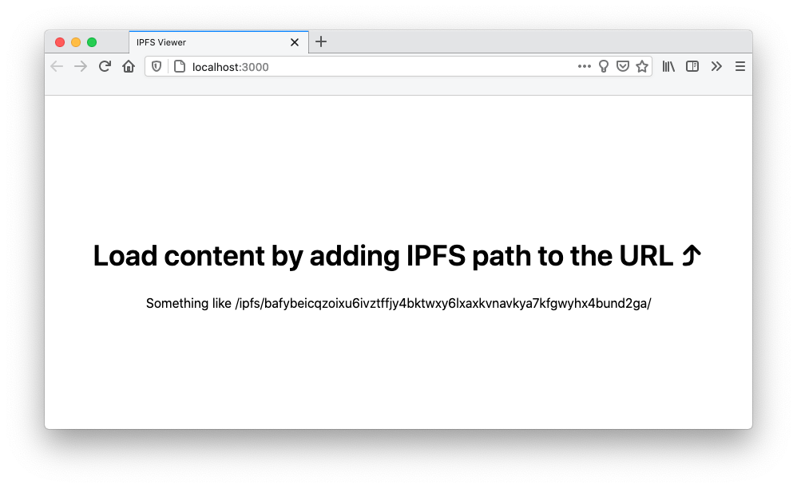
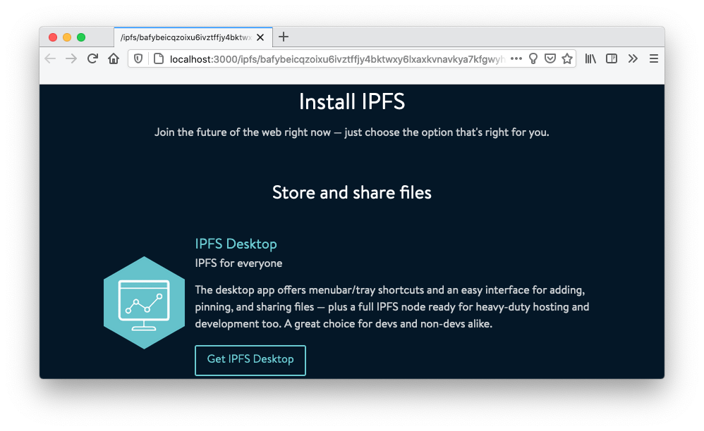

# Using js-ipfs node in [SharedWorker][] from [ServiceWorker][]

> In this example, you will find boilerplate code you can use to set up an IPFS
> node in a [SharedWorker][] and use it from a [ServiceWorker][].

File `src/worker.js` demonstrates how to setup and IPFS node in a [SharedWorker][]
such that it can be used in other browsing contexts.

File `src/service.js` demonstrates how the IPFS node we previously started in a
[SharedWorker][] can be used from a [ServiceWorker][].

File `src/main.js` demonstrates how to wire all the pieces together. It is also
a crucial piece that enables a [ServiceWorker][] to obtain a connection to the
[SharedWorker][] containing the IPFS node via a [MessagePort][]

## Before you start

First clone this repo, cd into the example directory and install the dependencies

```bash
git clone https://github.com/ipfs/js-ipfs.git
cd js-ipfs/examples/browser-service-worker
npm install
```

## Running the example

Run the following command within this folder:

```bash
npm start
```

Now open your browser at `http://localhost:3000`

You should see the following:



If you navigate to the following address `http://localhost:3000/ipfs/bafybeicqzoixu6ivztffjy4bktwxy6lxaxkvnavkya7kfgwyhx4bund2ga/` it should load a
page from ipfs and appear as:



### Run tests

```bash
npm test
```


[SharedWorker]:https://developer.mozilla.org/en-US/docs/Web/API/SharedWorker
[ServiceWorker]:https://developer.mozilla.org/en-US/docs/Web/API/Service_Worker_API
[MessagePort]:https://developer.mozilla.org/en-US/docs/Web/API/MessagePort
